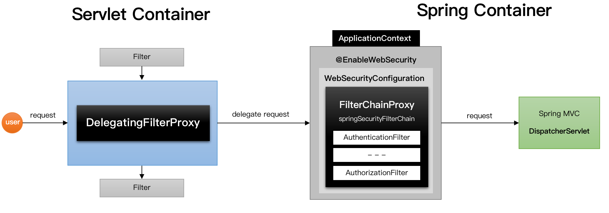
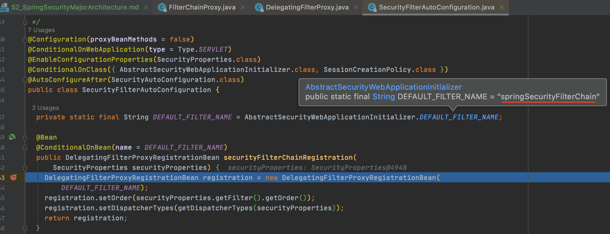
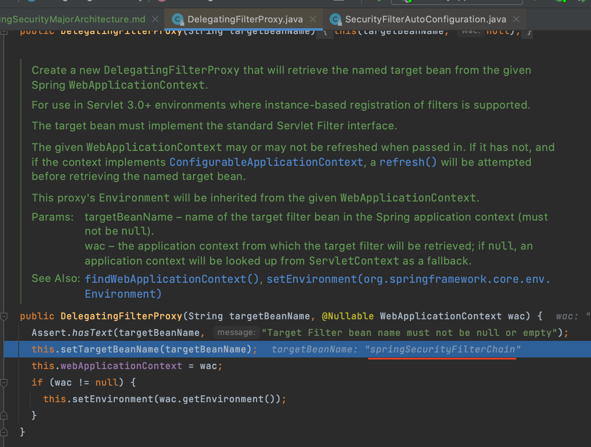
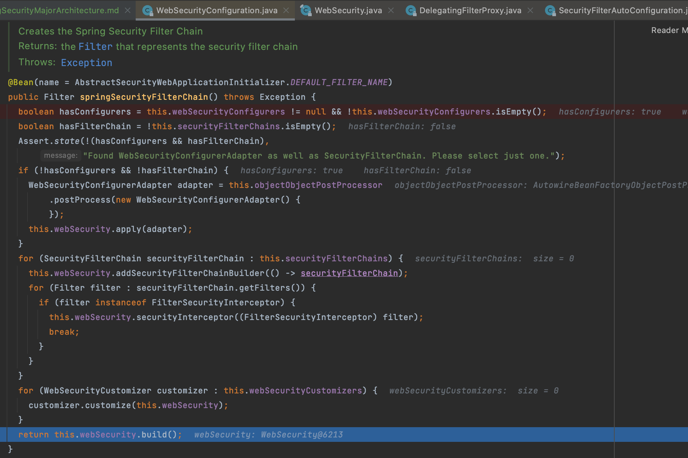
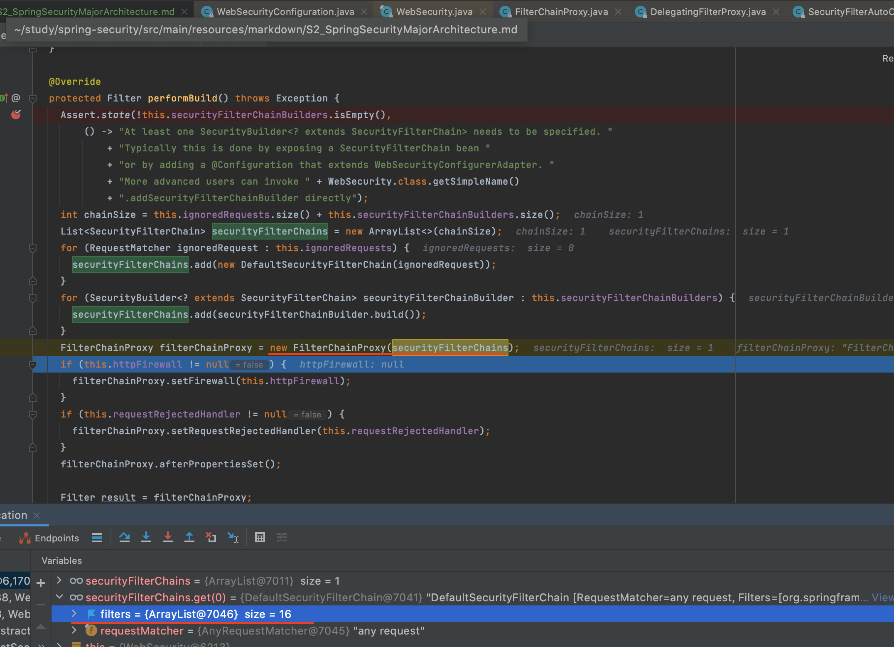
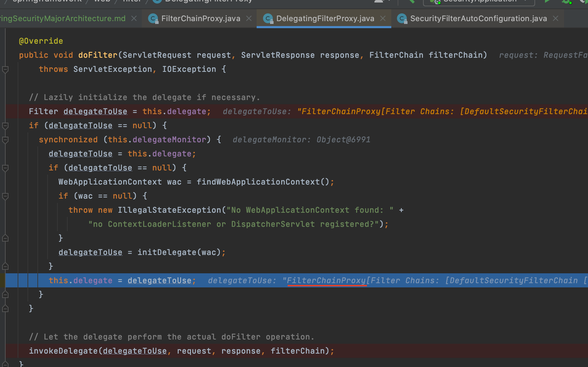
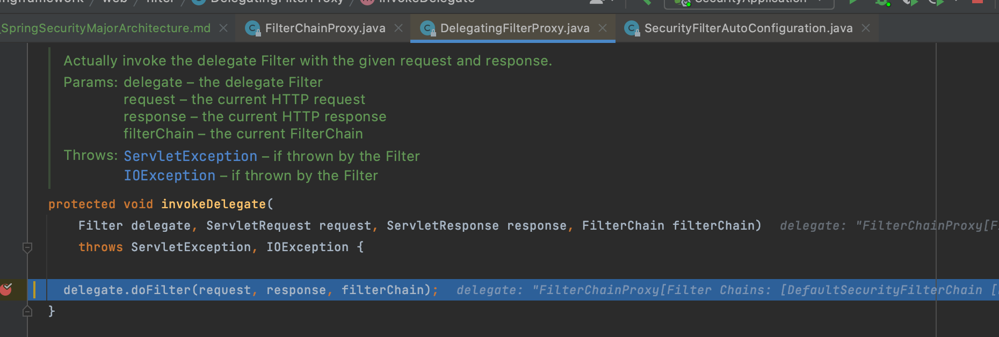
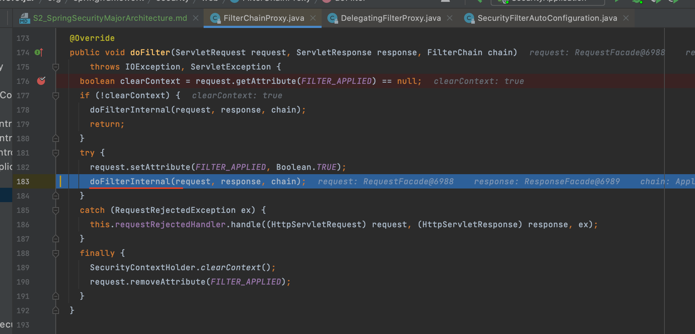

# 섹션2 스프링 시큐리티 주요 아키텍처

### 1. 위임 필터 및 필터 빈 초기화 - DelegatingFilterProxy, FilterChainProxy
1. DelegatingFilterProxy
    - ServletFilter
        - servlet 스펙 2.3부터 도입됨. servlet으로 요청이 들어가기 전, 후에 동작
        - servlet 컨테이너가 만들고 관리
        - 스프링에서 만든 내용을 주입받아 사용할 수 없음
    - DelegatingFilterProxy
        - servlet 필터를 거친 요청을 Spring Bean에 위임시키는 역할
        - servlet컨테이너가 초기화될 때 servletFilter로 등록됨
        - ApplicationContext에서 springSecurityFilterChain을 찾아 보안처리 위임
2. FilterChainProxy
    - springSecurityFilterChain이름으로 생성되는 스프링 빈
    - 스프링 시큐리티가 초기화될 때 관리할 필터들을 결정(기본필터 + 설정을 통한 추가필터)
    - 필터를 순서대로 호출해서 사용자 요청을 각각의 필터에 전달
    - 마지막 필터까지 예외가 발생하지 않으면 인증 통과
3. 순서 정리
> 순서
> ```
> 1. 서블릿 컨테이너 초기화할 때 SpringSecurity의 DelegatingFilterProxy를 서블릿 필터로 등록
> 2. ApplicationContext 초기화 될 때 springSecurityFilterChain 이름으로 설정된 securityFilter들을 가진 FilterChainProxy 등록
> 3. 서블릿 request가 들어오면 서블릿은 DelegatingFilterProxy를 통해 FilterChainProxy로 request를 보내 보안작업을 위임시킴
> 4. FilterChainProxy는 보안 작업을 수행
> 5. 보안 작업이 완료되면 서버로 요청 전달(DispatherServlet)
> ```
> 

> 서블릿 필터에서 springSecurityFilterChain이름을 찾을 수 있도록 설정하는 코드



> 스프링 컨테이너에 FilterChainProxy가 springSecurityFilterChain이름으로 등록되는 코드



> DelegatingFilterProxy가 springSecurityFilterChain을 찾고 그 필터에게 위임하는 동작



> springSecurityFilterChain이 작동(doFilterInternal메서드 안에 VertualFilterChain에서 실제 필터들이 수행됨)



