# 섹션2 스프링 시큐리티 주요 아키텍처

### 1. 위임 필터 및 필터 빈 초기화 - DelegatingFilterProxy, FilterChainProxy
1. DelegatingFilterProxy
    - ServletFilter
        - servlet 스펙 2.3부터 도입됨. servlet으로 요청이 들어가기 전, 후에 동작
        - servlet 컨테이너가 만들고 관리
        - 스프링에서 만든 내용을 주입받아 사용할 수 없음
    - DelegatingFilterProxy
        - servlet 필터를 거친 요청을 Spring Bean에 위임시키는 역할
        - servlet컨테이너가 초기화될 때 servletFilter로 등록됨
        - ApplicationContext에서 springSecurityFilterChain을 찾아 보안처리 위임
2. FilterChainProxy
    - springSecurityFilterChain이름으로 생성되는 스프링 빈
    - 스프링 시큐리티가 초기화될 때 관리할 필터들을 결정(기본필터 + 설정을 통한 추가필터)
    - 필터를 순서대로 호출해서 사용자 요청을 각각의 필터에 전달
    - 마지막 필터까지 예외가 발생하지 않으면 인증 통과
3. 순서 정리
> 순서
> ```
> 1. 서블릿 컨테이너 초기화할 때 SpringSecurity의 DelegatingFilterProxy를 서블릿 필터로 등록
> 2. ApplicationContext 초기화 될 때 springSecurityFilterChain 이름으로 설정된 securityFilter들을 가진 FilterChainProxy 등록
> 3. 서블릿 request가 들어오면 서블릿은 DelegatingFilterProxy를 통해 FilterChainProxy로 request를 보내 보안작업을 위임시킴
> 4. FilterChainProxy는 보안 작업을 수행
> 5. 보안 작업이 완료되면 서버로 요청 전달(DispatherServlet)
> ```
> 

> 서블릿 필터에서 springSecurityFilterChain이름을 찾을 수 있도록 설정하는 코드


> 스프링 컨테이너에 FilterChainProxy가 springSecurityFilterChain이름으로 등록되는 코드


> DelegatingFilterProxy가 springSecurityFilterChain을 찾고 그 필터에게 위임하는 동작


> springSecurityFilterChain이 작동(doFilterInternal메서드 안에 VertualFilterChain에서 실제 필터들이 수행됨)


### 2. 필터 초기화와 다중 보안 설정
1. 다중 보안 설정
    - 2개 이상의 SecurityConfig 클래스
    - 각각의 클래스는 RequestMatcher(Request URL)로 구분하고 순서(@Order)를 설정해야 한다.
    - 설정 클래스 별로 필터체인이 생성됨
    - 동작 방식
        - FilterChainProxy가 여러개의 SecurityFilterChain 객체를 갖는다(SecurityFilterChains)
        - 개별 SecurityFilterChain은 Filters(필터정보)와 RequestMatcher(요청정보)를 갖는다.
        - FilterChainProxy가 요청을 받으면 요청정보에 맞는 RequestMatcher를 갖는 SecurityFilterChain으로 보안작업을 수행한다.
        - 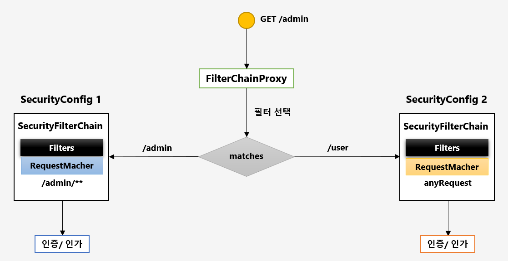
    - 테스트
        - security1은 인증필요, security2는 permitAll
        - ```
          @Test
          void needAuthorityConfig() throws Exception {
            ResultActions needAuthority = mockMvc.perform(get("/security1"));
            ResultActions permitAll = mockMvc.perform(get("/security2"));
            assertAll(() -> {
              needAuthority.andExpect(status().isUnauthorized());
              permitAll.andExpect(status().isOk());
            });
          }
          ```
        - 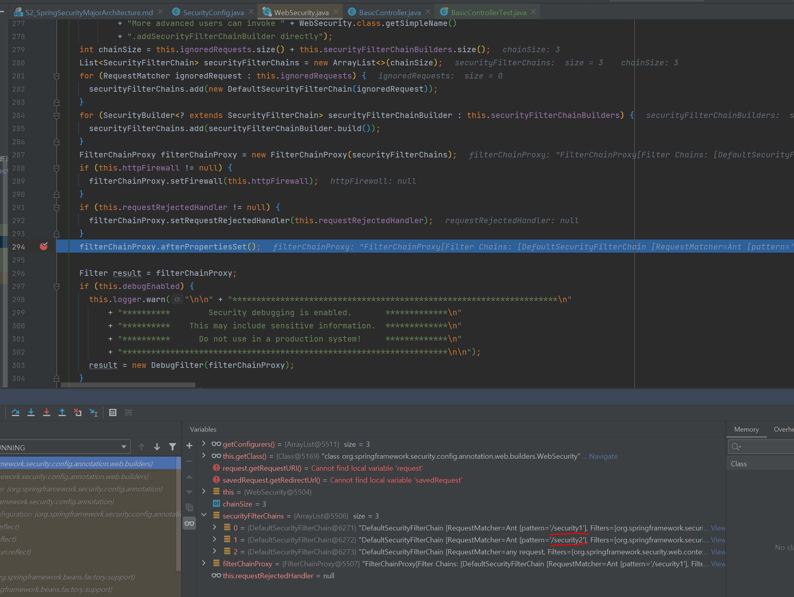
        - 필터체인 선정 시점(FilterChainProxy.doFilterInternal)
        - 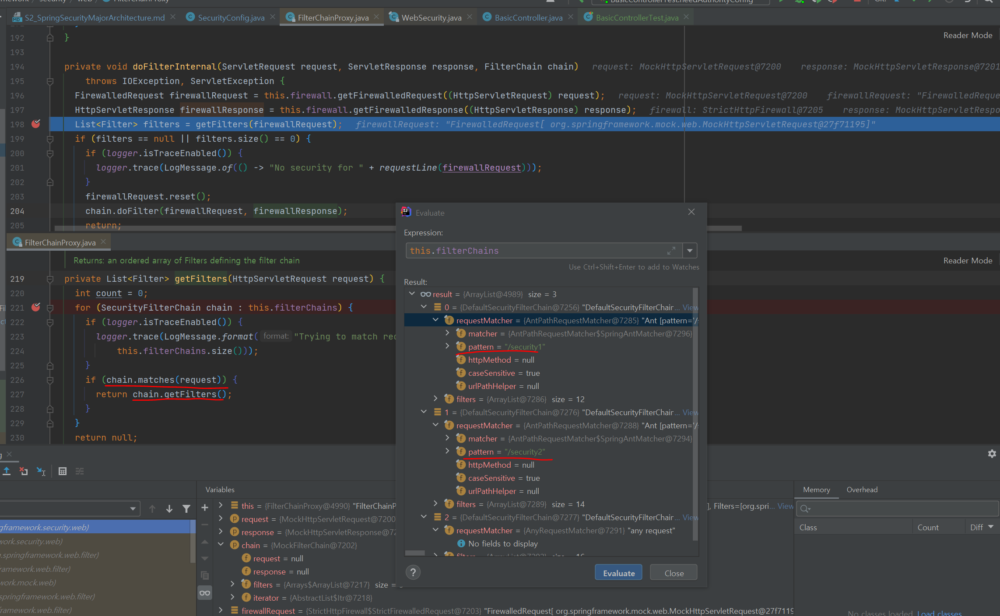

### 3. Authentication(인증)
1. Authentication?
    - 사용자가 누구인지 증명하는 것
    - 인증 결과는 SecurityContext에 저장되어 전역적으로 참조할 수 있다.
    - SpringSecurity에서는 interface이며 그 구현체를 인증정보를 전달하는 객체로 사용한다.
2. Authentication 객체가 포함하는 정보
   ```
   1. principal : 사용자 아이디 혹은 User 객체를 저장
   2. credentials : 사용자 비밀번호
   3. authorities : 인증된 사용자의 권한 목록
   4. details : 인증 부가 정보
   5. Authenticated : 인증 여부
   ```
3. SecurityContext에 저장되기 까지의 과정
   ```
   1. UsernamePasswordAuthenticationFilter에서 Authentication 객체 생성
   2. 이 때 Authentication principal은 username, credentials는 password(UsernamePasswordAuthenticationToken은 Authentication 구현체)
   3. Authentication 객체 AuthenticationManager로 전달
   4. 인증 후 인증객체를 갱신 : principal은 UserDetails, credentials는 null
   5. 인증정보를 SecurityContextHolder(ThreadLocal)에 저장
   ```

### 4. 인증 저장소 - SecurityContextHolder, SecurityContext
1. SecurityContext
   - Authentication 객체가 저장되는 보관소
   - 언제든지 Authentication 객체를 꺼내어쓸 수 있도록 제공되는 클래스
   - ThreadLocal에 저장되어 어디서나 참조가 가능
   - ThreadLocal : 다른 스레드에서는 접근할 수 없는 개별 Thread의 저장소
2. SecurityContextHolder
   - SecurityContext를 갖고있는 클래스
   - SecurityContext 저장 방식
   - ```
     1. MODE_THREADLOCAL : 하나의 스레드 당 하나의 SecurityContext 객체를 할당(default)
     2. MODE_INHERITABLETHREADLOCAL : 메인 스레드와 자식 스레드에 대해 동일한 SecurityContext를 유지
     3. MODE_GLOBAL : 응용 프로그램에서 단 하나의(static) SecurityContext를 갖는다.
     ```
   - 인증이 완료되면 저장방식에 따라 ThreadLocal에 인증정보를 저장하고 HttpSession에 SPRING_SECURITY_CONTEXT로도 저장.
   - 인증 후에 다시 접속할 때에는 session에 저장돼있던 SecurityContext를 가져온다.
   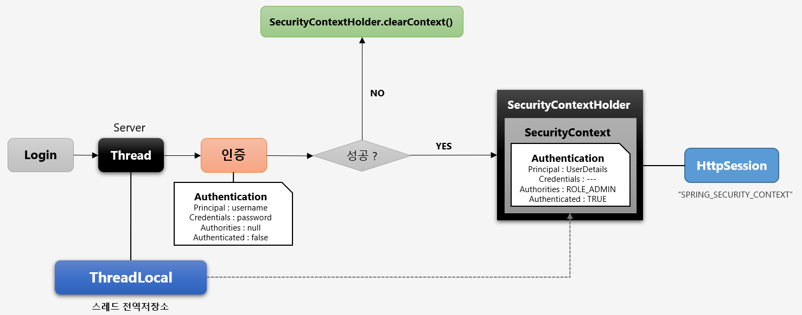

### 5. SecurityContextPersistenceFilter
1. SecurityContextPersistenceFilter
   - SecurityContext 객체의 생성, 저장, 조회 처리 역할
   - ```
     동작 순서
     - 새로운 SecurityContext 생성하여 SecurityContextHolder에 저장
     - 인증이 완료되면 Authentication 객체를 SecurityContext에 저장
     - 익명 사용자가 아닌 경우 Session에 SecurityContext 저장
     - 인증이 완료된 이후 다른 request가 들어오면 Session에서 SecurityContext를 꺼내어 SecurityContextHolder에 저장
     - SecurityContext안에 Authentication 객체가 존재하면 계속 인증을 유지한다.
     ```
   - 동작 코드 
      - SecurityContext를 Session에서 가져오는데 없으면 만들어준다.
      - finally에서 clear하고 session에 저장한다.
      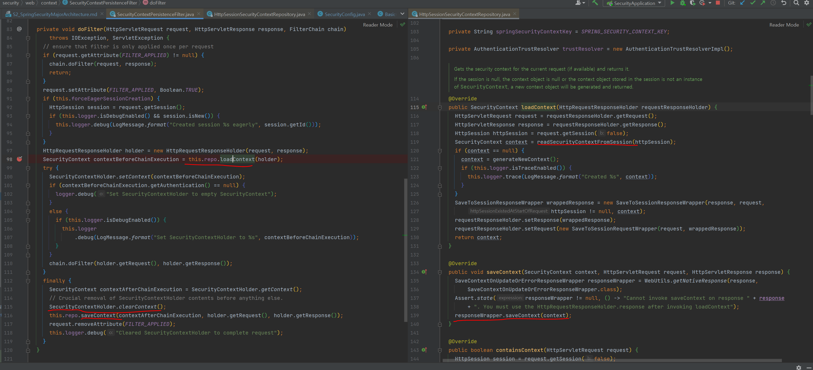

### 6. 인증 흐름 이해 AuthenticationFlow
1. 인증 흐름
   - UsernamePasswordAuthenticationFilter : 매니저로부터 받은 인증객체 SecurityContext에 저장 (AbstractAuthenticationProcessingFilter.successfulAuthentication)
   - AuthenticationManager : 인증의 전반적인 관리(위임, 토큰 객체 생성 등), 실제 인증 역할은 AuthenticationProvider에 위임
   - AuthenticationProvider : 실제 인증 처리, 유저 유효성 검증(패스워드 체크 등)
   - UserDetailsService : 유저 객체 조회, UserDetails타입으로 반환
   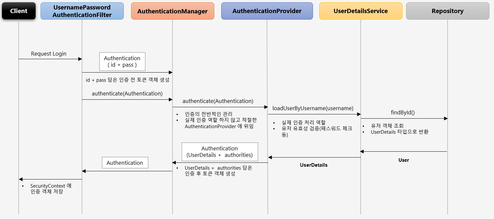

### 7. AuthenticationManager
1. AuthenticationManager
   - interface이며, 기본 구현체는 ProviderManager     
   - 인증처리는 Provider에게 위임
   - 선택하는 Provider는 인증 요청에 따라 다름(Form, RememberMe, Oauth)
   - 인증 요청에 적합한 Provider가 없는 경우 parent 필드에 적합한 Provider가 있는지 탐색해서 사용
   - 적합한지 아닌지는 Provider의 supports메서드 사용
   - 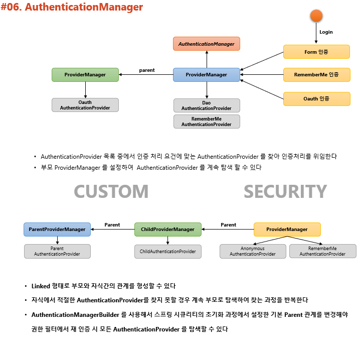
2. 초기화 과정
   - AuthenticationManagerBuilder에서 AuthenticationProvider를 추가함
   - 여러 개를 만들어 authenticationProviders에 add
   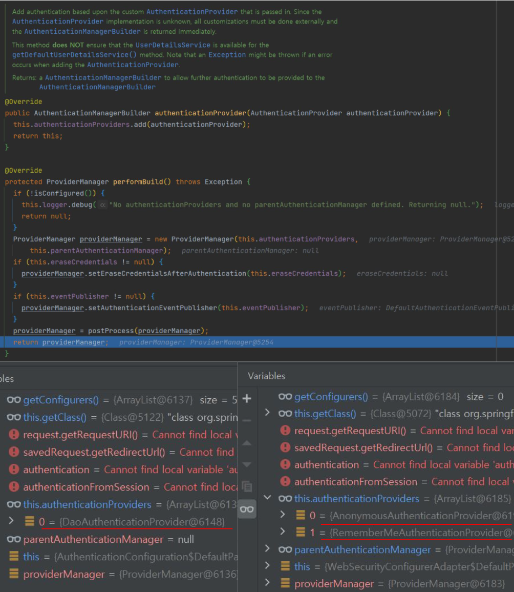   
3. 동작
   - 초기화 과정에서 결정된 Provider에게 인증 위임
   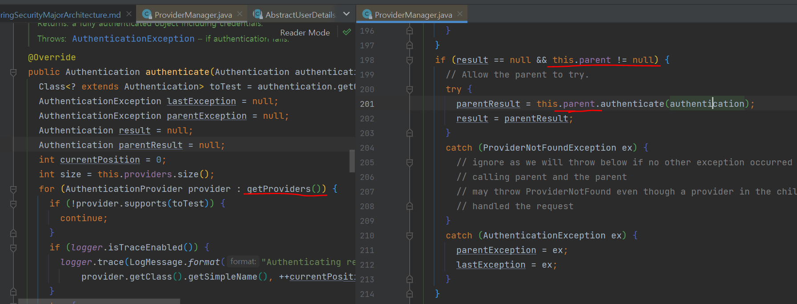
   - 적합 Provider인지 아닌지는 Provider의 supports메서드 사용해서 판단
   - 인증 객체 인스턴스 타입에 따라 선택
   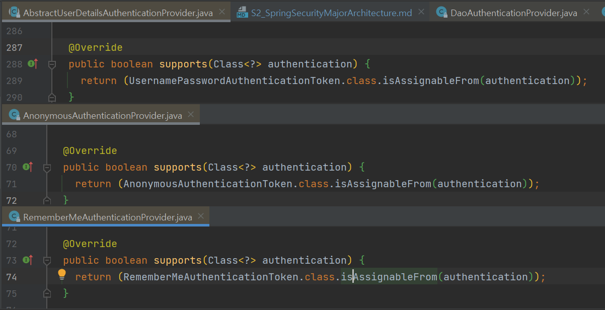
   - 작업이 완료되면 AuthenticationManager를 호출한 Filter로 인증 객체를 리턴

### 8. Authorization
   - 인가 : 접근이 허가된 권한을 갖는 사용자인지 입증하는 절차
   - ```
     웹 계층 : URL요청에 따른 화면 단위의 보안(ex_ GET /user/id01)
     서비스 계층 : 메서드 기능 단위의 보안 (ex_ public void getUserByUsername())
     도메인 계층 : 객체 단위의 보안
     ```
   - FilterSecurityInterceptor
      - 필터 체인 마지막에 위치한 필터
      - ```
        public class FilterSecurityInterceptor extends AbstractSecurityInterceptor implements Filter { ... }
        ```
      - 인증된 사용자의 요청에 대해 승인/거부 여부를 최종적으로 결정
      - 권한 처리는 AccessDecisionManager에 위임
      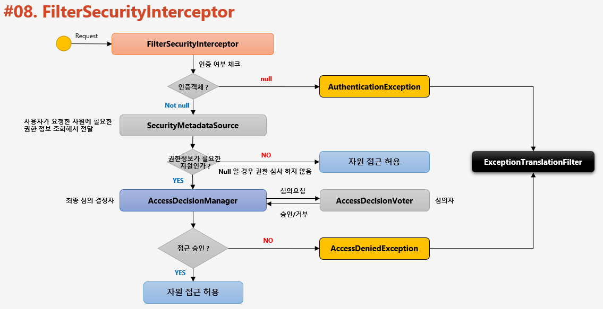
      - FilterSecurityInterceptor에서 super클래스의 beforeInvocation호출
      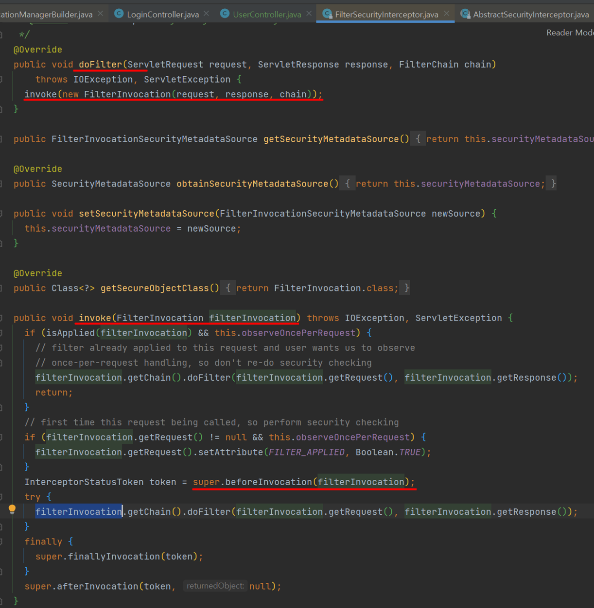
      - beforeInvocation : 메타데이터 활용해서 인가처리(AbstractSecurityInterceptor)
      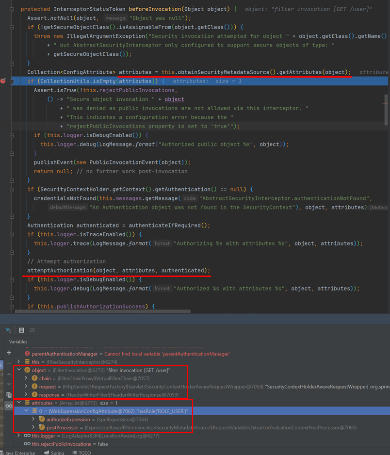
      - attemptAuthorization : AffirmativeBased가 인가 결정
      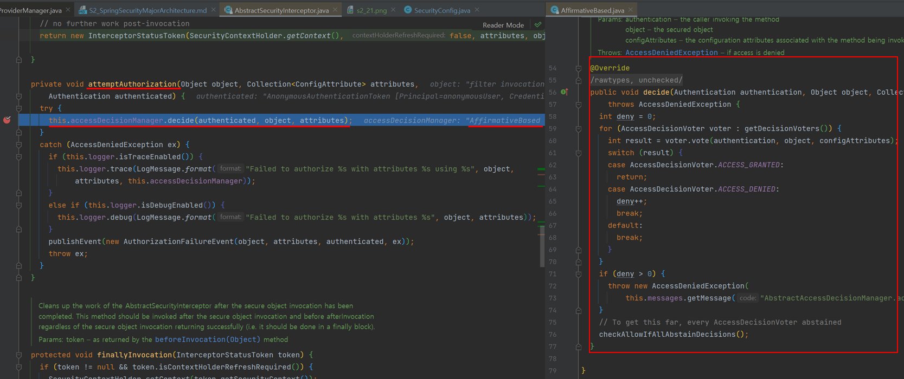

### 9. 인가결정 심의자
1. AccessDecisionManager
   - 사용자의 자원접근 허용여부를 최종 결정하는 주체
   - 여러 개의 Voter를 가지며 Voter들은 접근허용, 거부, 보류에 해당하는 각각의 값을 리턴한다.
   - 접근결정의 세 가지 유형
      1. AffirmativeBased : 하나라도 접근 허가면 허가 
      2. ConsensusBased : 다수표에의해 최종허가 판단. 동수일 경우 allowIfEqualGrantedDeniedDecisions옵션에 따름(default = 허가)
      3. UnanimousBased : 만장일치여야만 승인
2. AccessDecisionVoter
   - 판단을 심사하는 주체
   - 권한 부여의 판단 근거가 되는 자료
      1. Authentication : 인증정보
      2. FilterInvocation : 요청정보(antManager("/user"))
      3. ConfigAttributes : 권한정보(hasRole("USER"))
3. 구조
   - FilterSecurityInterceptor가 AccessDecisionManager에 인가처리를 요청하면?
   - AccessDecisionManager가 갖는 Voter들이 판단처리
   - 승인이 거부되면 ExceptionTranslationFilter가 처리
   
   - AccessDecisionVoter의 여러 구현체들
   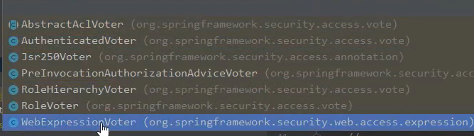

### 10. 정리
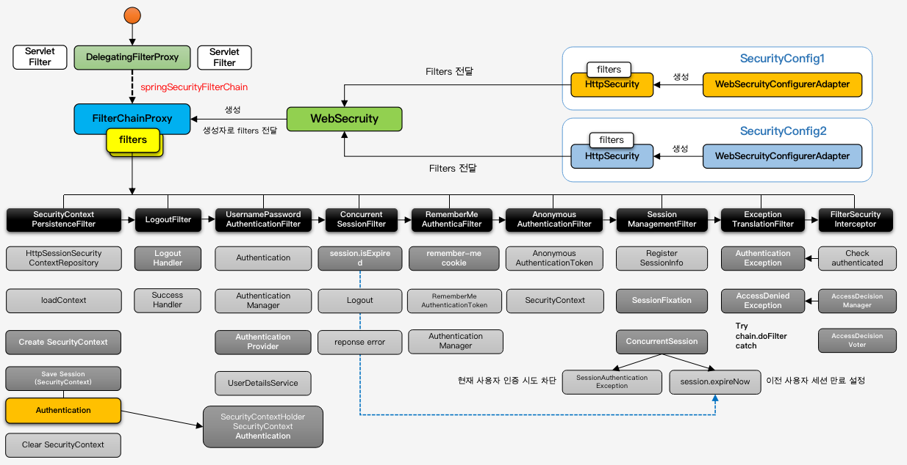
1. 초기화
```
1. SecurityConfig 선언
2. 선언된 대로 HttpSecurity가 filter들을 생성
3. WebSecurity가 HttpSecurity들의 filter목록을 받아 FilterChainProxy로 전달
4. DelegatingFilterProxy가 초기화될 때 springSecurityFilterChain이라는 빈을 찾아서 요청을 위임하게됨
5. springSecurityFilterChain빈은 FilterChainProxy
```
2. 인증 인가 과정 : 로그인 시도 - 성공
> 1~4 로그인 요청
> 5~12 자원접근 요청
   1. SecurityContextPersistenceFilter
      - SecurityContext가 있는지 확인
      - 있으면 가져오고 없으면 만들어줌
   2. LogoutFilter : 로그아웃 요청이 아니므로 패스
   3. UsernamePasswordAuthenticationFilter
      - 인증처리하고 SecurityContext에 인증객체 저장
      - AuthenticationManager, AuthenticationProvider, UserDetailsService
      - 인증에 성공하면 SessionManagementFilter에 선언된 기능을 사용해서 후속처리
      - LoginSuccessHandler에 따라 동작하게됨
   4. SecurityContextPersistenceFilter
      - 이 전에 로그인한 정보를 가져옴
   5. LogoutFilter : 로그아웃 요청이 아니므로 패스
   6. UsernamePasswordAuthenticationFilter : 인증 요청이 아니므로 패스
   7. ConcurrentSessionFilter : 동시세션제어가 아니므로 패스
   8. RememverMeAuthenticationFilter : remember-me cookie 확인
   9. AnonymousAuthenticationFilter : 인증사용자이므로 패스
   10. SessionManagementFilter : 세션이 있고 세션에 인증객체도 있기 때문에 패스
   11. ExceptionTranslationFilter : 인가예외 처리
   12. FilterSecurityInterceptor : 인가처리를 하는 필터로 예외발생시킴
