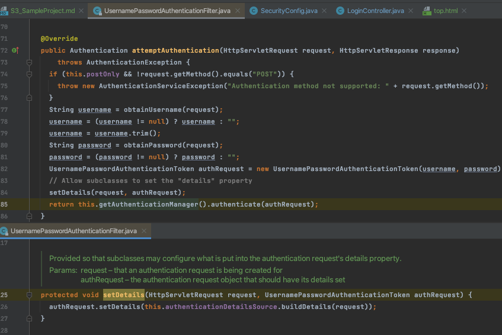

# 섹션3 실전 프로젝트

### 1. 실전 프로젝트 구성
1. 구성 : spring boot, spring mvc, spring data jpa, postgresql

### 2. 정적 자원 접근관리
인증, 인가가 필요 없는 정적 자원에 대해서는 무시하는 설정

permitAll은 필터체인을 거쳐서 무시되지만

ignore는 필터체인에 들어오지도 않음
```
@Configuration
@EnableWebSecurity
public class SecurityConfig extends WebSecurityConfigurerAdapter {

  private final String[] IGNORED_MATCHER_PATTERNS = {"/static/**", "/css/**", "/js/**", "/static/css/images/**", "/webjars/**", "/**/favicon.ico"};

  ...
  
  @Override
  public void configure(WebSecurity web) throws Exception {
    web.ignoring().antMatchers(IGNORED_MATCHER_PATTERNS);
  }

}
```

### 3. PasswordEncoder
1. 비밀번호 암호화 제공
2. 기본으로는 DelegatingPasswordEncoder 클래스 사용
    - 기본 : bcrypt
    - 상황에 맞게 선택해서 사용

### 4. DB 연동 인증처리
1. UserDetailsService 등록
   - UserDetailsService 구현체 선택(UserDetailsServiceCustom)
   - SecurityConfig에 등록
      ```
      @Configuration
      @EnableWebSecurity
      @RequiredArgsConstructor
      public class SecurityConfig extends WebSecurityConfigurerAdapter {
      
        private final UserDetailsService userDetailsService;
      
        @Override
        protected void configure(AuthenticationManagerBuilder auth) throws Exception {
          auth.userDetailsService(userDetailsService);
        }
      }
      ```
2. UserDetailsService 등록하면 뭐가되나?
   - 사용해서 UserDetails를 가져오는 loadUserByUsername 재정의
3. AuthenticationProvider
   - 인증 처리(비밀번호 검사 등)
      ```
      @Configuration
      @EnableWebSecurity
      public class SecurityConfig extends WebSecurityConfigurerAdapter {
      
        @Override
        protected void configure(AuthenticationManagerBuilder auth) throws Exception {
          // auth.userDetailsService(userDetailsService); -- authenticationProvider에서 가져오므로 더 이상 필요없음
          auth.authenticationProvider(authenticationProvider());
        }
        
        @Bean
        public AuthenticationProvider authenticationProvider() {
          return new AuthenticationProviderCustom();
        }
      }
      ```

### 5. 로그인 페이지, 로그아웃 커스터마이징
1. 로그인 페이지
    - SecurityConfig에 URL 등록
    - 등록한 URL 매핑(controller)
2. 로그아웃 커스터마이징(SecurityContextLogoutHandler)
    - 컨트롤러에서 처리
    - SecurityContextLogoutHandler.logout()

### 6. 인증 부가 기능 구현
1. WebAuthenticationDetails
   - 부가적인 정보를 사용
   - Authentication의 Object defails로 저장됨
   - 상속받아 사용 가능
2. AuthenticationDetailsSource
   - WebAuthenticationDetails를 생성해주는 역할
   - UsernamePasswordAuthenticationFilter에 setDetails메서드에서 사용(authenticationDetailsSource.buildDetails)
   - 구현체를 SecurityConfig에서 등록해서 커스터마이징 가능
   
3. AuthenticationSuccessHandler
   - AuthenticationHandler 인터페이스 구현, 구현체 상속 등
   - ```
     // SecurityConfig
     http
       ...
       .formLogin()
         ...
         .successHandler(authenticationSuccessHandler)
       ...

     
     // AuthenticationSuccessHandlerCustom
     @Component
     public class AuthenticationSuccessHandlerCustom extends SimpleUrlAuthenticationSuccessHandler {     
       private RequestCache requestCache = new HttpSessionRequestCache();     
       private RedirectStrategy redirectStrategy = new DefaultRedirectStrategy();
            
       @Override
       public void onAuthenticationSuccess(HttpServletRequest request, HttpServletResponse response, Authentication authentication) throws IOException, ServletException {
         setDefaultTargetUrl("/");
         SavedRequest savedRequest = requestCache.getRequest(request, response);
         if (savedRequest != null) {
           String targetUrl = savedRequest.getRedirectUrl();
           redirectStrategy.sendRedirect(request, response, targetUrl);
         } else {
           redirectStrategy.sendRedirect(request, response, getDefaultTargetUrl());
         }
       }     
     }
     ```
4. AuthenticationFailureHandler
   - 인증실패 처리
   - AuthenticationHandler 인터페이스 구현, 구현체 상속 등
   - ```
     // SecurityConfig
     http
       ...
       .formLogin()
         ...
         .failureHandler(authenticationFailureHandler)
       ...
     
     // AuthenticationFailureHandler
     @Component
     public class AuthenticationFailureHandlerCustom extends SimpleUrlAuthenticationFailureHandler {     
       @Override
       public void onAuthenticationFailure(HttpServletRequest request, HttpServletResponse response, AuthenticationException exception) throws IOException, ServletException {
         String errorMessage = "Invalid Username or Password";
         if (exception instanceof InsufficientAuthenticationException) {
           errorMessage = "Invalid Secret Key";
         }
         setDefaultFailureUrl("/login?error=true&exception=" + errorMessage);
         super.onAuthenticationFailure(request, response, exception);
       }     
     }
     ```

5. AccessDeniedHandler
   - 인가예외 처리
   - ```
     @Component
     public class AccessDeniedHandlerCustom implements AccessDeniedHandler {     
       @Override
       public void handle(HttpServletRequest request, HttpServletResponse response, AccessDeniedException accessDeniedException) throws IOException, ServletException {
         String deniedUrl = "/denied?message=" + accessDeniedException.getMessage();
         response.sendRedirect(deniedUrl);
       }     
     }
     ```