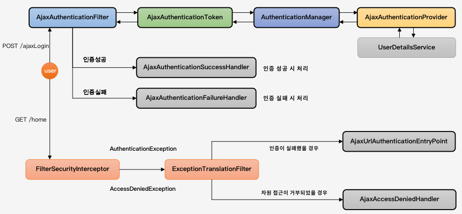
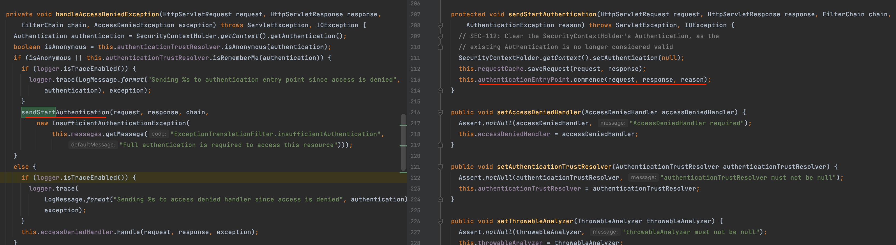

# 섹션4 실전 프로젝트(Ajax 인증 구현)

### 1. 흐름 및 개요


### 2. 인증 필터(AjaxAuthenticationFilter)
```
필터 구현 및 추가 작업 순서
   - AbstractAuthenticationProcessingFilter 상속
   - "/api/login" url로 Ajax 요청이 들어오는 경우 필터가 작동하도록 구현
   - AjaxAuthenticationToken을 AuthenticationManager에 전달해서 인증처리
   - 구현한 필터를 추가
```
1. 필터 구현
    - AjaxLoginProcessingFilter
2. 필터 추가
    - addFilter : this.filterOrders.getOrder(filter.getClass())의 order에 맞게 지정되며, order가 없으면 예외발생
    - addFilterAt : 지정된 필터의 순서에 넣어주지만 동일한 순서를 갖는 필터들은 서로 순서가 없고 override 하지 않는다.
    - addFilterBefore : 특정 필터 전에 필터 추가
    - addFilterAfter : 특정 필터 이후에 필터 추가
    - ```
      @Override
      protected void configure(HttpSecurity http) throws Exception {
        http
         ...
         .and()
          .addFilterBefore(ajaxLoginProcessingFilter(), UsernamePasswordAuthenticationFilter.class)
        ;
      }    
      @Bean
      public AjaxLoginProcessingFilter ajaxLoginProcessingFilter() {
        AjaxLoginProcessingFilter filter = new AjaxLoginProcessingFilter();
        filter.setAuthenticationManager(authenticationManagerBean());
        return filter;
      }
      ```
3. AuthenticationProvider 구현 및 설정
    - service.AjaxAuthenticationProviderCustom
    - Ajax 인증요청에 대해 인증로직 수행(id, password 검증)

4. 인증 핸들러 구현 및 설정
    - Ajax 인증방식에서 인증성공, 인증실패에 대한 처리를 하기 위함
    - 인증 성공
      ```
      handler.AjaxAuthenticationSuccessHandlerCustom
      application/json 타입으로 HttpStatus.OK 응답
      ```
    - 인증 실패
      ```
      handler.AjaxAuthenticationFailureHandlerCustom
      application/json 타입으로 HttpStatus.OK 응답
      실패 메세지 포함
      ```
    - Filter에 설정(AjaxLoginProcessingFilter)
      ```
      @Bean
      public AjaxLoginProcessingFilter ajaxLoginProcessingFilter() throws Exception {
        AjaxLoginProcessingFilter filter = new AjaxLoginProcessingFilter();
        filter.setAuthenticationManager(authenticationManagerBean());
        filter.setAuthenticationSuccessHandler(ajaxAuthenticationSuccessHandler());
        filter.setAuthenticationFailureHandler(ajaxAuthenticationFailureHandler());
        return filter;
      }
      ```

5. 인증 및 인가 예외처리
    - FilterSecurityInterceptor(AbstractSecurityInterceptor) : 인가처리하는 클래스
      - 인증받지 않은 사용자가 접근한 경우 예외발생
      - 예외를 발생시키면 ExceptionTranslationFilter가 받아서 처리
      - 익명사용자인 경우 authenticationEntryPoint.commence를 호출(로그인 페이지로 이동시키는 등의 작업)
      
    - AjaxLoginAuthenticationEntryPointCustom
      - 익명사용자가 권한이 필요한 자원에 접근하는 경우의 로직 선언
    - AjaxAccessDeniedHandlerCustom
      - 인증을 받았지만 권한은 없는 사용자가 권한이 필요한 자원에 접근하는 경우

6. 커스텀 DSL로 Config 구현 : https://docs.spring.io/spring-security/site/docs/current/reference/html5/#jc-custom-dsls
    - DSL : 도메인 특화 언어
    - 목표 : 설정 모음 객체를 만들어서 SecurityConfig에 적용
    - AjaxLoginConfigurer
    - ```
      @Override
      protected void configure(HttpSecurity http) throws Exception {
        http
          .antMatcher("/api/**")
          .authorizeRequests()
          .antMatchers("/api/messages").hasRole("MANAGER")
          .anyRequest().authenticated()
        ;      
        ajaxConfigureCustom(http);
      }      
      private void ajaxConfigureCustom(HttpSecurity http) throws Exception {
        http
          .apply(new AjaxLoginConfigurer<>())
          .successHandlerAjax(new AjaxAuthenticationSuccessHandlerCustom())
          .failureHandlerAjax(new AjaxAuthenticationFailureHandlerCustom())
          .setAuthenticationManager(authenticationManagerBean())
          .loginProcessingUrl("/api/login")
        ;
      }
      ```
7. CSRF
    - 페이지 meta태그에 CSRF 토큰 값을 내리고, ajax호출할 때 토큰 값을 헤더에 포함시켜서 접근하는 방식
      ```
      <meta id="_csrf" name="_csrf" th:content="${_csrf.token}"/>
      <meta id="_csrf_header" name="_csrf_header" th:content="${_csrf.headerName}"/>
      <script>
      function ajaxLogin() {
        ...      
        let csrfHeader = $("meta[name='_csrf_header]']").val().trim();
        let csrfToken = $("meta[name='_csrf]']").val().trim();
        $.ajax({
          type : "post",
          url : "/api/login",
          data : JSON.stringify(data),
          dataType : "json",
          beforeSend : function(xhr) {
              xhr.setRequestHeader(csrfHeader, csrfToken);
          },
          ...
        });
      }
      </script>
      ```